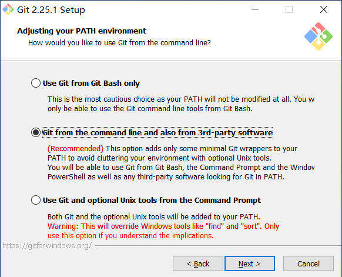

# Git/Gitea Installation

Official Installation Tutorial: [Win](https://git-scm.com/download/win), [Mac](https://git-scm.com/download/mac), [Linux](https://git-scm.com/download/linux)

First, open your terminal and run `git --version` . If the version of git is shown, then you can skip this part.

## Windows Git Installation

Find the version that suits your system (32-bit or 64-bit), run the installer, and follow the installation process. Just click "Next" all the way through the installation setup, ensuring that the setting on the page for environment variables is the second option.




## MacOS Git Installation

Turn off SJTU VPN first!

Before you install, you can check whether you have already installed git in your terminal by typing:

  ```Bash  
 $ git 
  ```

If the result is command not found, then you have to install git:

1. Install brew (for students in China) 

```bash
$ /bin/bash -c "$(curl -fsSL  https://gitee.com/ineo6/homebrew-install/raw/master/install.sh)"  
```

or you may use: https://mirrors.tuna.tsinghua.edu.cn/help/homebrew/

If you are **outside** China, use the following command instead:

  ```bash
$ /bin/bash -c "$(curl -fsSL https://raw.githubusercontent.com/Homebrew/install/HEAD/install.sh)"
  ```

2. Do an update to test the brew.

  ```bash
$ brew upgrade
  ```

3. Now install git by brew:

```bash
$ brew install git
```

##  Linux Git Installation

You may refer to -> https://www.git-scm.com/download/linux

## Test Installation

Open your terminal and run `git --version` . If the version of git is shown, then git is properly installed.
