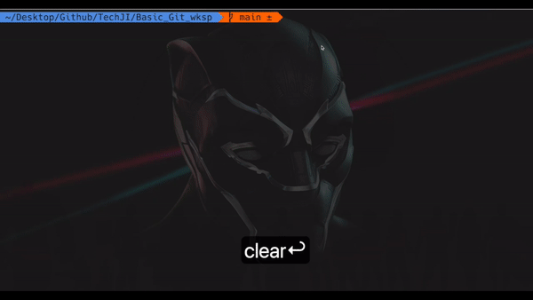
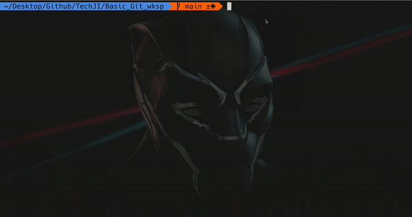

# [Lazygit](https://github.com/jesseduffield/lazygit) Installation

Official website -> https://github.com/jesseduffield/lazygit

## Windows Installation

If you are using wsl with ubuntu or arch, you can refer to official website.

If you are using windows directly, run the following command in your `powershell`

```powershell
$ winget install -e --id=JesseDuffield.lazygit
```

Then restart `powershell` and then you can call lazygit by running `lazygit` in powershell.

If you have `oh-my-posh` installed, you can set an alias for `lazygit`. If you don't have `oh-my-posh`, you can simply skip the following part.

To set alias for lazygit, you can type the command to edit the profile of powershell.

If you haven't edit `$PROFILE` before, you need run commands below:

```shell
if (!(Test-Path -Path $PROFILE)) {
  New-Item -ItemType File -Path $PROFILE -Force
}
```

```powershell
$ notepad $PROFILE
```

 Then add the content to the profile.

```powershell
$ New-Alias -Name lg -Value lazygit
```

You can use following command to source the new profile and then you can use `lg` to call the lazygit.

```powershell
$ . $PROFILE
```

For another way, you can download the package  and install it -> https://github.com/jesseduffield/lazygit/releases

To call `lazygit`, you need copy the full path of `lazygit.exe` or you can add it to the PATH(for reference -> https://learn.microsoft.com/zh-cn/previous-versions/office/developer/sharepoint-2010/ee537574(v=office.14)).

## MacOS Installation

```zsh
$ brew install lazygit
```

Similarly, add the following content to your `~/.zshrc` with command and source it.

```zsh
$ echo "alias lg='lazygit'" >> ~/.zshrc
$ source ~/.zshrc
```

## Linux Installation

Use package manager or refer to the [official website](https://github.com/jesseduffield/lazygit).

## Test Installation

Open your terminal and `cd` into a git repository. Then run `lazygit`, if a TUI surface is generated, it is installed properly.

## Difference between using lazygit and writing commands in terminal

For Lazygit users, one single push takes about 10 seconds.



For command line users,  one single push takes about 30 seconds or longer.


