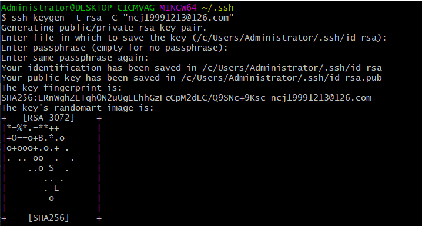

# Setup Github

GitHub is an online platform for hosting and managing source code repositories, using Git as the version control software.

### Create a GitHub account.

Go to the website of [Github](https://github.com) and *Sign Up*:


### Simple Git Configuration

> Note: From this step onward, for Windows users, it is recommended to right-click on the desktop and then select **Git Bash Here** from the menu. This is a command line provided by Git that you just downloaded. Linux and macOS users can use the terminal that comes with the system.

#### Configure username and password.

Open the command line and enter the following two commands (press Enter after each one, do not copy `$`):

```bash
$ git config --global user.name "your_username"
$ git config --global user.email "your@email.com"
```

Note: Replace `your_username` with the username of your newly created GitHub account, and replace `your@email.com` with the email you used for registration. (Keep the double quotes outside as they are.)

### Configure SSH key and associate it with GitHub.

#### Generate ssh-key

In simple terms, this step is to allow GitHub to authenticate your identity, enabling you to smoothly download and upload code. An SSH key is a type of password, usually stored in two files: a private key and a public key. The public key is shared with others for identity verification, while the private key must be securely kept and not shared with anyone.

Similarly, still within the command line, run the following(do not copy `$`):

```bash
$ ssh-keygen -t rsa -C "your@email.com"
```

Similarly, here you need to replace it with the email you used for registration. Then, you will be prompted to enter some information one by one. If you don't want to specify, you can simply press `enter` throughout. The meanings of these input parameters are as follows:

- Path to save the SSH key file: It defaults to ~/.ssh, and if you don't remember, it's better not to change it.
- Passphrase: This is a password, generally not widely used. It is only required in certain situations where your key needs to be accessed. Usually, you can leave it blank.
- Confirm Passphrase: If you set a passphrase in the previous step, enter it again for confirmation.



When you see a series of strange characters appear, it indicates that you have successfully created it.

#### Upload ssh-key

Firstly, you need to locate the key you just created. Run the following two commands in sequence(do not copy `$`):

```bash
$ cd ~/.ssh
$ cat id_rsa.pub
```

The meanings are as follows:

- `cd ~/.ssh`: Enter a folder named `.ssh`, where `~` represents your user directory. (If you are using Windows and cmd, open a new cmd and type `cd .ssh`.)
- `cat id_rsa.pub`: Display the content of the file `id_rsa.pub`, which is your public key. (If you are using cmd, replace `cat` with `type`.)


Then, log in to GitHub, go to your account settings in the upper right corner, and navigate to SSH and GPG keys. Choose to add a new SSH key. You can input any title you like. In the input box below, paste the content of the public key that you just printed in the command line (from "ssh-rsa" to the end of your email). Finally, click the bottom button to complete the addition.

> Note: Do not copy your private key (`id_rsa`). The private key is much longer than the public key.


#### Verify

Let's quickly validate. Still at the top right corner of the page, click on the plus sign, select "New Repository," and create a new code repository.


`Repository name` is the name of your project and cannot contain spaces. `Description` is a brief description of your project. `Public` means anyone can see this project, while `Private` means only you can see it. Finally, it is recommended to select "Initialize this repository with a README" so that a README file is automatically included when the project is created.


Then you will be redirected to the homepage of your new project. Locate the only green button on the page, click on it, and then click on the button in the image to copy your project's address to the clipboard.

> Here, try to copy the address starting with 'git@' if the default one displayed starts with 'https.' If your default address is in the form of 'https,' click on "use SSH" to view the 'git@' address.


Finally, return to your command line and execute the following commands one by one (do not copy the part after the # symbol and do not copy `$`):

```bash
$ cd ~/Desktop                      # 进入桌面
$ git clone <your_repo_address>     # clone你刚刚创建的项目
```

Note: Replace `<your_repo_address>` with the project address you just copied, **without using angle brackets or double quotes**.

You may encounter a prompt asking if you want to continue the connection. Type `yes` and press Enter.

After a while, when it finishes running, you will find a folder on your desktop named after your project, containing the content of the project you just created. At this point, it indicates that you have successfully installed and configured Git.

Now, **you can use the command line to operate Git and perform all version control functions**.

### Install Git GUI（Optinal）

In simple terms, Git GUI is a type of desktop software that **saves you from the pain of typing command lines**. Its relationship with Git is just icing on the cake—without GUI software, you can still perform all operations using Git commands in the command line. Of course, GUI software adds some practical tools to the mix.

>  GUI software is just a shell; all the operations it performs are still silently invoking the `git` commands in the background.

Suggestions：

+ [Lazygit](https://github.com/jesseduffield/lazygit) (Windows, Mac, Linux) -> You may refer to `Installation_Lazygit.md` in this repo.

* Sourcetree (Windows, Mac)
* GitKraken (Windows, Mac, Linux)

These are generally easy to operate, relatively stable, and, moreover, all of them are free.
